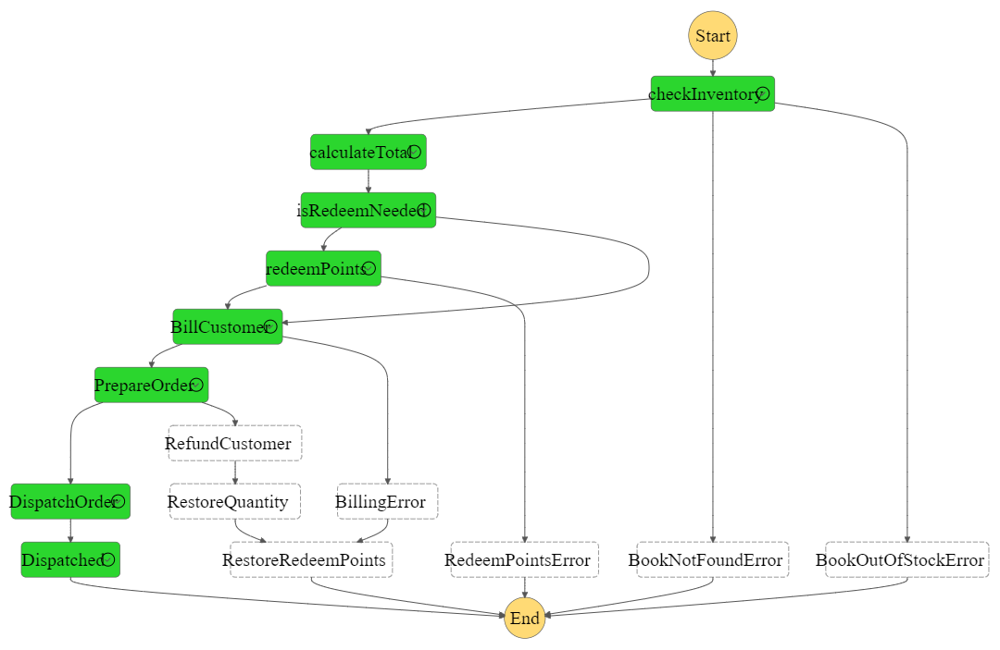

# Buld and Deploy a step function with AWS serverless services using serverless framework

This project is a simple implementation of a store checkout process.

## What are the resources used in this architecture?

Step Functions

Lambda

SQS

SNS

DynamoDB

IAM

The Diagram below shows the workflows involved in this state machine. We equally took
care of errors arising from the workflows.

